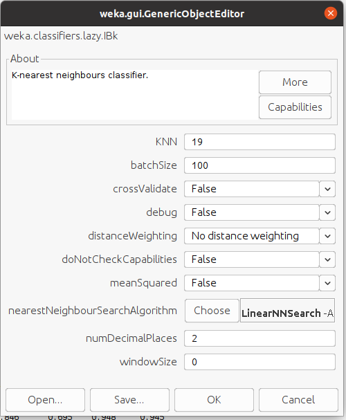
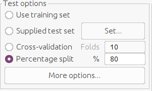
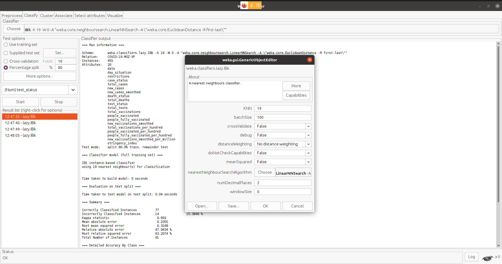

# data-mining

# Geração do modelo

Para a geração dos modelos usou se o algoritmo iBk que é equivalente ao KNN, com os parametros na imagem 1 a baixo.

imagem 1 com estes paramentros aplicou o algoritmo usando os casos de teste da imagem 2.

imagem 2

para a obteção dos modelos que respondem à:

1. Para o dia "date", com o tipo de dia ("day_situation"  e "restrictions") que Classificação e predição da situação dos teste (test_status) se tem?
2. Para o dia "date", com o tipo de dia ("day_situation"  e "restrictions") que Classificação e predição da situação das mortes (death_status) se tem?
3. Para o dia "date", com o tipo de dia ("day_situation"  e "restrictions") que Classificação e predição da situação dos casos (case_status) se tem?

nestes termos, gerou os medelos com as condições abaixo:

#Modelos Gerados

##Informação geral
=== Run information ===

    Scheme:       weka.classifiers.lazy.IBk -K 19 -W 0 -A "weka.core.neighboursearch.LinearNNSearch -A \"weka.core.EuclideanDistance -R first-last\""
    Relation:     COVID-19-MOZ-VF
    Instances:    455
    Attributes:   20
    Attributes List
    date
    day_situation
    restrictions
    case_status
    total_cases
    new_cases
    new_cases_smoothed
    death_status
    total_deaths
    test_status
    total_tests
    total_vaccinations
    people_vaccinated
    people_fully_vaccinated
    new_vaccinations_smoothed
    total_vaccinations_per_hundred
    people_vaccinated_per_hundred
    people_fully_vaccinated_per_hundred
    new_vaccinations_smoothed_per_million
    stringency_index

Test mode:    split 80.0% train, remainder test

=== Classifier model (full training set) ===

    IB1 instance-based classifier
    using 19 nearest neighbour(s) for classification

# Test Status

### === Evaluation on test split ===

Time taken to test model on test split: 0.01 seconds

### === Summary ===

    Correctly Classified Instances          74               81.3187 %
    Incorrectly Classified Instances        17               18.6813 %
    Kappa statistic                          0.6244
    Mean absolute error                      0.1648
    Root mean squared error                  0.2859
    Relative absolute error                 48.782  %
    Root relative squared error             68.2417 %
    Total Number of Instances               91

Com este modelo se obteve cerca de 81.32% de acertos num total de 91 instâncias de testadas.

### === Detailed Accuracy By Class ===

                     TP Rate  FP Rate  Precision  Recall   F-Measure  MCC      ROC Area  PRC Area  Class
                     0.000    0.000    ?          0.000    ?          ?        0.994     0.667     MAINTAIN
                     0.918    0.310    0.776      0.918    0.841      0.631    0.920     0.927     INCREASE
                     0.725    0.078    0.879      0.725    0.795      0.668    0.941     0.922     DECREASE
    Weighted Avg.    0.813    0.201    ?          0.813    ?          ?        0.931     0.919

### === Confusion Matrix ===

        MAINTAIN  INCREASE  DECREASE   +
        0         2         0          | MAINTAIN
        0         45        4          | INCREASE
        0         11        29         | DECREASE
Com este modelo se obteve a matriz de confusão acima, da qual se pode notar que:
 1. Das 91 instâncias de testadas, preve se uma probabilidade de 0% de chances dos números de testes se manterem iguais ao da semana anterior;
 2. Das 91 instâncias de testadas, preve se uma probabilidade de 49.45% de chances dos números de testes aumentar em relação à semana anterior;
 3. Das 91 instâncias de testadas, preve se uma probabilidade de 31.86% de chances dos números de testes reduzirem em relação à semana anterior; e
 4. A restante percentagem (18.69%) corresponde a probabilidade total de erro das chances totais. Ou seja, há 2.19% da probabilidade do modelo errar ao dizer os aumentar ao no lugar de dizer que vão manter, 4.39% da probabilidade do modelo errar ao dizer os que os números vão reduzir ao no lugar de dizer que vão aumentar e 12.08% da probabilidade do modelo errar ao dizer os que os números vão aumentar ao no lugar de dizer que vão decrescer.

# Death Status

### === Evaluation on test split ===

Time taken to test model on test split: 0.01 seconds

### === Summary ===

    Correctly Classified Instances          66               72.5275 %
    Incorrectly Classified Instances        25               27.4725 %
    Kappa statistic                          0.5833
    Mean absolute error                      0.3004
    Root mean squared error                  0.371
    Relative absolute error                 67.879  %
    Root relative squared error             78.8944 %
    Total Number of Instances               91

### === Detailed Accuracy By Class ===

                     TP Rate  FP Rate  Precision  Recall   F-Measure  MCC      ROC Area  PRC Area  Class
                     0.731    0.015    0.950      0.731    0.826      0.780    0.948     0.871     MAINTAIN
                     0.813    0.254    0.634      0.813    0.712      0.536    0.821     0.715     INCREASE
                     0.636    0.155    0.700      0.636    0.667      0.492    0.867     0.710     DECREASE
    Weighted Avg.    0.725    0.150    0.748      0.725    0.728      0.590    0.874     0.758

### === Confusion Matrix ===

        MAINTAIN  INCREASE  DECREASE   +
        19         3         4         |  MAINTAIN
        1         26         5         |   INCREASE
        0         12         21        |  DECREASE
Com este modelo se obteve a matriz de confusão acima, da qual se pode notar que:
1. Das 91 instâncias de testadas, preve se uma probabilidade de 0% de chances dos números de testes se manterem iguais ao da semana anterior;
2. Das 91 instâncias de testadas, preve se uma probabilidade de 49.45% de chances dos números de testes aumentar em relação à semana anterior;
3. Das 91 instâncias de testadas, preve se uma probabilidade de 31.86% de chances dos números de testes reduzirem em relação à semana anterior; e
4. A restante percentagem (18.69%) corresponde a probabilidade total de erro das chances totais. Ou seja, há 2.19% da probabilidade do modelo errar ao dizer os aumentar ao no lugar de dizer que vão manter, 4.39% da probabilidade do modelo errar ao dizer os que os números vão reduzir ao no lugar de dizer que vão aumentar e 12.08% da probabilidade do modelo errar ao dizer os que os números vão aumentar ao no lugar de dizer que vão decrescer.

# Case Status

### === Evaluation on test split ===

Time taken to test model on test split: 0.01 seconds

### === Summary ===

    Correctly Classified Instances          77               84.6154 %
    Incorrectly Classified Instances        14               15.3846 %
    Kappa statistic                          0.692
    Mean absolute error                      0.2355
    Root mean squared error                  0.3168
    Relative absolute error                 47.0634 %
    Root relative squared error             63.2074 %
    Total Number of Instances               91

### === Detailed Accuracy By Class ===

                     TP Rate  FP Rate  Precision  Recall   F-Measure  MCC      ROC Area  PRC Area  Class
                     0.800    0.109    0.878      0.800    0.837      0.695    0.948     0.945     INCREASE
                     0.891    0.200    0.820      0.891    0.854      0.695    0.948     0.944     DECREASE
    Weighted Avg.    0.846    0.155    0.849      0.846    0.846      0.695    0.948     0.945

### === Confusion Matrix ===

        INCREASE  DECREASE  +
        36        9         | INCREASE
        5         41        | DECREASE
Com este modelo se obteve a matriz de confusão acima, da qual se pode notar que:
1. Das 91 instâncias de testadas, preve se uma probabilidade de 39.56% de chances dos números de testes aumentar em relação à semana anterior;
2. Das 91 instâncias de testadas, preve se uma probabilidade de 45.05% de chances dos números de testes reduzirem em relação à semana anterior; e
3. A restante percentagem (15.39%) corresponde a probabilidade total de erro das chances totais. Ou seja, há 5.49% da probabilidade do modelo errar ao dizer os aumentar ao no lugar de dizer que vão reduzir e 9.89% da probabilidade do modelo errar ao dizer os que os números vão reduzir ao no lugar de dizer que vão aumentar.

#Informações do Ambiente usado:
    KEY                                 VALUE
    WEKA_HOME                           /home/carlos-matlule/wekafiles
    awt.toolkit                         Sun.awt.X11.XToolkit
    file.encoding                       UTF-8
    file.separator                  	/
    java.awt.graphicsenv            	sun.awt.X11GraphicsEnvironment
    java.awt.printerjob             	sun.print.PSPrinterJob
    java.class.path                 	/opt/weka-3-8-5/weka.jar
    java.class.version                  55.0
    java.home                       	/opt/weka-3-8-5/jre/zulu11.43.55-ca-fx-jre11.0.9.1-linux_x64
    java.io.tmpdir                  	/tmp
    java.library.path               	/usr/java/packages/lib:/usr/lib64:/lib64:/lib:/usr/lib:/home/carlos-matlule/wekafiles/native
    java.runtime.name               	OpenJDK Runtime Environment
    java.runtime.version            	11.0.9.1+1-LTS
    java.specification.name         	Java Platform API Specification
    java.specification.vendor	        Oracle Corporation
    java.specification.version      	11
    java.vendor                     	Azul Systems, Inc.
    java.vendor.url                 	http://www.azulsystems.com/
    java.vendor.url.bug             	http://www.azulsystems.com/support/
    java.vendor.version             	Zulu11.43+55-CA
    java.version	                    11.0.9.1
    java.version.date	                2020-11-04
    java.vm.compressedOopsMode      	Zero based
    java.vm.info	                    mixed mode
    java.vm.name	                    OpenJDK 64-Bit Server VM
    java.vm.specification.name      	Java Virtual Machine Specification
    java.vm.specification.vendoR     	Oracle Corporation
    java.vm.specification.version   	11
    java.vm.vendor                  	Azul Systems, Inc.
    java.vm.version                     11.0.9.1+1-LTS
    jdk.debug	                        release
    jdk.vendor.version              	Zulu11.43+55-CA
    line.separator
    memory.initial                  	250MB (262144000)
    memory.max	                        3978MB (4171235328)
    os.arch	                            amd64
    os.name	                            Linux
    os.version	                        5.8.0-59-generic
    path.separator	                    :
    sun.arch.data.model             	64
    sun.awt.enableExtraMouseButtons	    true
    sun.boot.library.path	            /opt/weka-3-8-5/jre/zulu11.43.55-ca-fx-jre11.0.9.1-linux_x64/lib
    sun.cpu.endian	                    little
    sun.cpu.isalist
    sun.desktop                     	gnome
    sun.font.fontmanager            	sun.awt.X11FontManager
    sun.io.unicode.encoding         	UnicodeLittle
    sun.java.command	                weka.gui.GUIChooser
    sun.java.launcher	                SUN_STANDARD
    sun.jnu.encoding	                UTF-8
    sun.management.compiler         	HotSpot 64-Bit Tiered Compilers
    sun.os.patch.level	                unknown
    ui.currentLookAndFeel	            com.sun.java.swing.plaf.gtk.GTKLookAndFeel
    ui.installedLookAndFeels            javax.swing.plaf.metal.MetalLookAndFeel,javax.swing.plaf.nimbus.NimbusLookAndFeel,com.sun.java.swing.plaf.motif.MotifLookAndFeel,com.sun.java.swing.plaf.gtk.GTKLookAndFeel
    user.country                        US
    user.dir                        	/opt/weka-3-8-5
    user.home	                        /home/carlos-matlule
    user.language                       en
    user.name                       	carlos-matlule
    user.timezone                   	Africa/Maputo
    weka.version                    	3.8.5